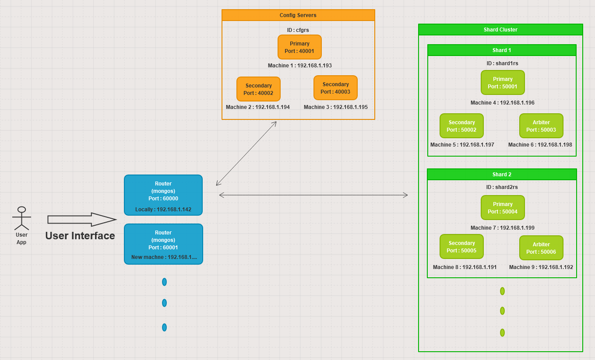

# Set up Sharding using Docker Containers

The below explanation shows how to setup sharding MongoDB running as docker containers on multiple  machines.

The setup contains a mongos router which acts a interface for the user to query. 
A config server containing metadata and configuration of the shards and the router.
Finally sharded cluster, data will be stored across the shards evenly.
In the example shown, first two shards are set up. In the future for the extension
just follow the same procedure to add in the shard in a different machine, and 
add the shard to the cluster via mongos router as explained for the shard2.
Each of all the shards and the config servers have 3 replica sets, so that 
when one of them goes down we have a redundancy plan in place to not loose
the data. This is very important for the production to make data available 
abundantly. So that if something goes wrong measurement data can still be
recovered and calculation can be done seamlessly.
Below diagram shows the clear picture of how it is working.



## Authentication

Enforcing access control on a sharded cluster requires configuring:

 - Security between components of the cluster using Internal Authentication.
 - Security between connecting clients and the cluster using User Access Controls.

Each member of the sharded cluster must use the same internal authentication 
mechanism and settings. This means enforcing internal authentication on each 
mongos and mongod in the cluster. Keyfile is used to enable internal authentication.

### Create a Keyfile

You can generate a keyfile using any method you choose. We have used openssl
to generate a complex pseudo-random 1024 character string to use as a shared 
password. It then uses chmod to change file permissions to provide read 
permissions for the file owner only:
```
openssl rand -base64 756 > <path-to-keyfile>
chmod 400 <path-to-keyfile>
```

#### Distribution of Keyfile

Copy the keyfile to each server hosting the sharded cluster members. Ensure 
that the user running the mongod or mongos instances is the owner of the file
and can access the keyfile. In our case if mongos running on server with
IPAddress 192.168.1.210, create a keyfile in here and copy the file to rest all servers.


### Config servers
Start config servers (3 member replica set) in 3 different machines.

If config server primary to run on a machine with IP address: 192.168.1.193
```
docker-compose -f config-server/cnfig-server-primary.yml up -d
```
If config server secondary(1) to run on a machine with IP address: 192.168.1.194
```
docker-compose -f config-server/cnfig-server-sec1.yml up -d
```
If config server secondary(2) to run on a machine with IP address: 192.168.1.195
```
docker-compose -f config-server/cnfig-server-sec2.yml up -d
```
Initiate replica set on the primary config server initiated machine:
```
mongo mongodb://192.168.1.193:40001
```
```
rs.initiate(
  {
    _id: "cfgrs",
    configsvr: true,
    members: [
      { _id : 0, host : "192.168.1.193:40001" },
      { _id : 1, host : "192.168.1.194:40002" },
      { _id : 2, host : "192.168.1.195:40003" }
    ]
  }
)

rs.status()
```

### Shard 1 servers
Start shard 1 servers (3 member replicas set) in 3 different machines.

If shard1 primary to run on a machine with IP address: 192.168.1.196
```
docker-compose -f shard1/shard1-primary.yml up -d
```
If shard1 secondary to run on a machine with IP address: 192.168.1.197
```
docker-compose -f shard1/shard1-sec.yml up -d
```
If shard1 arbiter to run on a machine with IP address: 192.168.1.198
```
docker-compose -f shard1/shard1-arbiter.yml up -d
```
Initiate replica set on the primary shard1 initiated machine:
```
mongo mongodb://192.168.1.196:50001
```
```
rs.initiate(
  {
    _id: "shard1rs",
    members: [
      { _id : 0, host : "192.168.1.196:50001" },
      { _id : 1, host : "192.168.1.197:50002" },
      { _id : 2, host : "192.168.1.198:50003" }
    ]
  }
)

rs.status()
```

Create the shard-local user administrator. Make sure you are connected to the 
primary shard to create the users. 
```
admin = db.getSiblingDB("admin")
admin.createUser(
  {
    user: "shard1-cluster-admin",
    pwd: "shard1-cluster-admin",
    roles: [ { role: "userAdminAnyDatabase", db: "admin" } ]
  }
)
```

**Hint** : You can use passwordPrompt() method instead of directly writing 
the password. You can enter the password when prompted.

Authenticate as the shard-local user administrator. Authenticate to the admin database.
```
db.getSiblingDB("admin").auth("shard1-cluster-admin", passwordPrompt()) // or cleartext password
```
Enter the password when prompted.

Alternatively, connect a new mongo shell to the primary replica set member using the 
-u <username>, -p <password>, and the --authenticationDatabase parameters.
```
mongo -u "shard1-cluster-admin" -p "shard1-cluster-admin"  --authenticationDatabase "admin"
```

Create the shard-local cluster administrator. The shard-local cluster administrator user 
has the clusterAdmin role, which provides privileges that allow access to replication operations. 
Create a cluster administrator user and assign the clusterAdmin role in the admin database:
```
db.getSiblingDB("admin").createUser(
  {
    "user" : "shard1-cluster-local",
    "pwd" : "shard1-cluster-local"
    roles: [ { "role" : "clusterAdmin", "db" : "admin" } ]
  }
)
```

### Mongos Router

#### Start mongos query router.
If mongos router to run locally with IPaAdress: 192.168.1.142
```
docker-compose -f mongos/docker-compose.yaml up -d
```

#### Connect to mongos
```
mongo mongodb://192.168.1.142:60000
```

####  Create the user administrator
```
admin = db.getSiblingDB("admin")
admin.createUser(
  {
    user: "admin",
    pwd: "admin",
    roles: [ { role: "userAdminAnyDatabase", db: "admin" } ]
  }
)
```

#### Authenticate as the user administrator.
Use db.auth() to authenticate as the user administrator to create additional users:
```
db.getSiblingDB("admin").auth("admin", passwordPrompt()) // or cleartext password
```
Enter the password when prompted.

Alternatively, connect a new mongo shell to the target replica set member using
the -u <username>, -p <password>, and the --authenticationDatabase "admin" parameters.
```
mongo -u "admin" -p "admin"  --authenticationDatabase "admin"
```

#### Create Administrative User for Cluster Management
The cluster administrator user has the clusterAdmin role, which grants access to 
replication and sharding operations. Create a clusterAdmin user in the admin database.
```
db.getSiblingDB("admin").createUser(
  {
    "user" : "admin-cluster",
    "pwd" : "admin-cluster"
    roles: [ { "role" : "clusterAdmin", "db" : "admin" } ]
  }
)
```

#### Create additional users
Create users to allow clients to connect and access the sharded cluster.
```
use sharddemo
db.createUser(
    {
        user: "sips",
        pwd: "e5PKQe9fc3kLuW",
        roles:[
            {
                role: "readWrite",
                db: "sharddemo"
            }
        ]
    }
);

db.createRole({role : "readWriteSystem", privileges: [{resource: { db: "sharddemo", collection: "system.indexes" }, actions: [ "changeStream", "collStats", "convertToCapped", "createCollection", "createIndex", "dbHash", "dbStats", "dropCollection", "dropIndex", "emptycapped", "find", "insert", "killCursors", "listCollections", "listIndexes", "planCacheRead", "remove", "renameCollectionSameDB", "update" ]}], roles:[]})
db.grantRolesToUser('sips', ['readWriteSystem'])
```

### Add shard to the cluster
To proceed, you must be connected to the mongos and authenticated as the cluster 
administrator user for the sharded cluster.
```
mongo -u "admin-cluster" -p "admin-cluster"  --authenticationDatabase "admin"
```

Add shard
```
mongos> sh.addShard("shard1rs/192.168.1.196:50001,192.168.1.197:50002,192.168.1.198:50003")
mongos> sh.status()
```

#### Enable Sharding for a Database
To shard the collection, first database sharding needs to be enabled.
Then collection can be sharded, database can have non-sharded and
sharded collection at the same time.

To enable sharding in database
```
mongos> sh.enableSharding("sharddemo")
```

Now, to shard the collection 'measurements'.

**Note**: Picking right shardkey is very important, as performance of
the database depends on it.
```
mongos> sh.shardCollection("sharddemo.measurements", {"title": "hashed"})
```

To check if collection 'measurements' has been sharded
```
mongos> db.measurements.getShardDistribution()
```


## Adding another shard
### Shard 2 servers
Start shard 2 servers (3 member replicas set) in 3 different machines.

If shard2 primary to run on a machine with IP address: 192.168.1.199
```
docker-compose -f shard2/shard2-primary.yml up -d
```
If shard2 secondary to run on a machine with IP address: 192.168.1.191
```
docker-compose -f shard2/shard2-sec.yml up -d
```
If shard2 arbiter to run on a machine with IP address: 192.168.1.192
```
docker-compose -f shard2/shard2-arbiter.yml up -d
```
Initiate replica set
```
mongo mongodb://192.168.1.199:50004
```
```
rs.initiate(
  {
    _id: "shard2rs",
    members: [
      { _id : 0, host : "192.168.1.199:50004" },
      { _id : 1, host : "192.168.1.191:50005" },
      { _id : 2, host : "192.168.1.192:50006" }
    ]
  }
)

rs.status()
```

Create the shard-local user administrator. Make sure you are connected to the
primary shard to create the users.
```
admin = db.getSiblingDB("admin")
admin.createUser(
  {
    user: "shard2-cluster-admin",
    pwd: "shard2-cluster-admin",
    roles: [ { role: "userAdminAnyDatabase", db: "admin" } ]
  }
)
```

**Hint** : You can use passwordPrompt() method instead of directly writing
the password. You can enter the password when prompted.

Authenticate as the shard-local user administrator. Authenticate to the admin database.
```
db.getSiblingDB("admin").auth("shard2-cluster-admin", passwordPrompt()) // or cleartext password
```
Enter the password when prompted.

Alternatively, connect a new mongo shell to the primary replica set member using the
-u <username>, -p <password>, and the --authenticationDatabase parameters.
```
mongo -u "shard2-cluster-admin" -p "shard2-cluster-admin"  --authenticationDatabase "admin"
```

Create the shard-local cluster administrator. The shard-local cluster administrator user
has the clusterAdmin role, which provides privileges that allow access to replication operations.
Create a cluster administrator user and assign the clusterAdmin role in the admin database:
```
db.getSiblingDB("admin").createUser(
  {
    "user" : "shard2-cluster-local",
    "pwd" : "shard2-cluster-local"
    roles: [ { "role" : "clusterAdmin", "db" : "admin" } ]
  }
)
```

### Add shard to the cluster
Connect to mongos
```
mongo mongodb://192.168.1.142:60000
```
Add shard
```
mongos> sh.addShard("shard2rs/192.168.1.199:50004,192.168.1.191:50005,192.168.1.192:50006")
mongos> sh.status()
```
